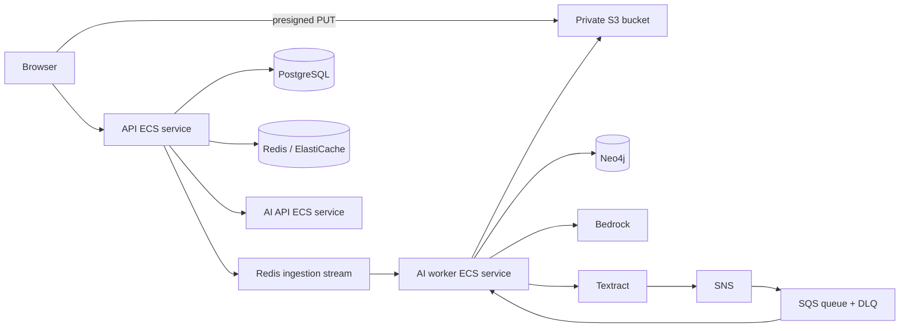

# AWS Dataset Ingestion Deployment

This guide deploys the private knowledge-dataset flow added to SperoFlow. It
uses S3 as the canonical source store, ECS task roles instead of long-lived AWS
keys, Amazon Textract for scanned PDFs, and Bedrock for optional semantic
extraction. MinIO remains the local-development compatibility store.

## Runtime topology



The browser can upload only a single approved object through a short-lived PUT
URL. It never receives database, Neo4j, Bedrock, Textract, SQS, or task-role
credentials. The API validates owner assignment before issuing a URL and
verifies size, declared type, SHA-256, and binary signatures before it queues a
job.

## AWS resources and requirements

Create these resources in the same AWS Region:

- A private, versioned S3 bucket for dataset objects, with all public access
  blocked, default encryption enabled (SSE-S3 or SSE-KMS), and lifecycle rules
  suitable for retained source data.
- An SNS topic for Textract job completion, an SQS queue subscribed to it, and
  an SQS dead-letter queue. Configure the subscription for raw delivery only
  if the worker configuration is changed accordingly; the current worker
  accepts the standard SNS envelope.
- An RDS PostgreSQL instance, a private Neo4j deployment (or Aura), and Redis
  / ElastiCache. These remain private to the application network.
- ECS services for `api`, `ai-api`, and `ai-worker`. The worker must be a
  separate service/task so no browser or AI API route can write graph data.
- VPC endpoints or controlled egress for S3, Bedrock Runtime, Textract, SNS,
  and SQS. Use a NAT gateway only when required by the selected services.

The application limits uploads to 100 MB. This is deliberately below Textract
asynchronous PDF/TIFF limits (500 MB and 3,000 pages); see the [Textract
quotas](https://docs.aws.amazon.com/textract/latest/dg/limits-document.html)
and [asynchronous workflow](https://docs.aws.amazon.com/textract/latest/dg/api-async.html).

## Bucket configuration

1. Block all public access and enable versioning and default encryption.
2. Configure CORS for the exact HTTPS web origin, allowing `PUT` and the
   headers returned by the API: `Content-Type`,
   `x-amz-server-side-encryption`, and (when KMS is enabled)
   `x-amz-server-side-encryption-aws-kms-key-id`.
3. Do not expose a bucket policy granting anonymous read or list access.
4. If using SSE-KMS, allow the API and worker task roles to use the selected
   key only for this bucket and prefix.
5. Pass the bucket name to both API and worker services. The worker reads the
   private object after the API has finalized it; it does not rely on a public
   download URL.

Example production API configuration:

```text
ObjectStorage__Provider=S3
ObjectStorage__BucketName=speroflow-production-datasets
ObjectStorage__Region=us-east-1
ObjectStorage__KmsKeyId=arn:aws:kms:us-east-1:123456789012:key/example   # optional
Accounts__AllowPublicRegistration=false
```

Example AI-worker configuration:

```text
OBJECT_STORAGE_BUCKET=speroflow-production-datasets
OBJECT_STORAGE_ENDPOINT_URL=
BEDROCK_REGION=us-east-1
TEXTRACT_SNS_TOPIC_ARN=arn:aws:sns:us-east-1:123456789012:speroflow-textract
TEXTRACT_SQS_QUEUE_URL=https://sqs.us-east-1.amazonaws.com/123456789012/speroflow-textract
TEXTRACT_ROLE_ARN=arn:aws:iam::123456789012:role/speroflow-textract-publish
```

Leave `OBJECT_STORAGE_ENDPOINT_URL` empty for AWS S3. For local MinIO, set it
to the private MinIO endpoint and supply the MinIO access and secret keys only
to the API and AI worker.

## Least-privilege task roles

Attach the API task policy in
[`aws/ecs-api-dataset-policy.json`](aws/ecs-api-dataset-policy.json) and the
worker policy in
[`aws/ecs-worker-dataset-policy.json`](aws/ecs-worker-dataset-policy.json),
substituting the account, Region, bucket, queue, topic, KMS key, and Bedrock
model ARNs. The Textract notification role needs only permission to publish to
the configured SNS topic; it is separate from the worker role.

The API role issues S3 presigned writes and verifies finalized objects. The
worker role may read the scoped dataset prefix, call Textract and Bedrock, and
consume/delete only the configured SQS queue. Neither task role needs broad S3
or administrator permissions.

## First administrator bootstrap

Public registration is intentionally closed by default. Before the first
deployment, create a high-entropy one-time bootstrap token and mount it at
`/run/secrets/admin_bootstrap_token` in the API task. Register the intended
administrator using that token, then confirm their email. The API atomically
records the claim and grants `Admin` only to that confirmed user. Do not enable
public registration to bootstrap an administrator.

For Compose-based local or demo deployments, use the
`compose.admin-bootstrap.yaml` overlay and create the token file under
`infrastructure/secrets/` (which is ignored by Git). ECS deployments should
store the value in Secrets Manager and mount it as the same file path.

## Deployment and verification

1. Apply the PostgreSQL migration before starting the API service.
2. Deploy API, AI API, and AI worker with separate task roles and private
   security groups.
3. Bootstrap and confirm the intended administrator.
4. As that administrator, create a dataset, assign an existing user as owner,
   and upload a small CSV or text file from `/admin/knowledge`.
5. Check that the job transitions through `queued`, `processing`, and either
   `succeeded` or `succeeded with warnings`. A low-text PDF may transition to
   `waiting for OCR` until Textract/SQS completion.
6. Sign in as the assigned owner and issue a chat request with
   `scope: "dataset"` and only that dataset ID. Confirm citations are returned.
7. Attempt the same query as a different user and verify it is rejected before
   the AI API receives the request.

For a short demo, one ECS task definition may contain application containers,
but keep S3, RDS, and Neo4j external/private. It is suitable only for low
traffic: the AI worker shares CPU and memory with request-serving containers,
so uploads, embeddings, OCR polling, and chat latency contend. Use separate
ECS services for any sustained or multi-user workload.
