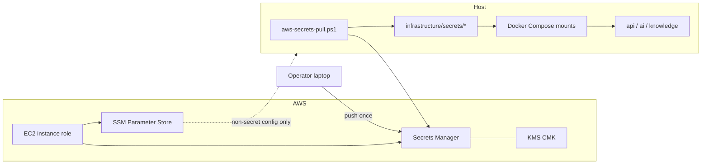

# Managed Secrets (AWS Secrets Manager + SSM)

## Goal

Stop treating the EC2 disk as the source of truth for secrets. Store secret
material in **AWS Secrets Manager** (with KMS), optionally keep non-secret
deployment config in **SSM Parameter Store**, and materialize files only on the
host at boot for the existing Compose `/run/secrets` contract.

This design **does not rewrite application code**. Entry points already read
`/run/secrets/*` (`entrypoint-dotnet.sh`, `entrypoint-ai.sh`, Options paths).



## SM vs SSM

| Store | Use for SperoFlow |
|-------|-------------------|
| **Secrets Manager** | All secret values: passwords, tokens, RSA private keys, PFX certs, MinIO keys, optional static Bedrock key |
| **SSM Parameter Store (String)** | Non-secret config only if desired later: `APP_DOMAIN`, model IDs, feature flags — **not** passwords |
| **SSM SecureString** | Avoid for this stack; prefer SM for one rotation/audit story and binary-friendly secrets |
| **IAM / instance role** | Bedrock, S3, Textract — **prefer over any static cloud key** |

## Naming

```text
speroflow/{environment}/{secret_name}
```

Examples:

- `speroflow/prod/postgres_password`
- `speroflow/prod/service_jwt_private_key`
- `speroflow/prod/oidc_signing_certificate`
- `speroflow/staging/knowledge_neo4j_writer_password`

`{secret_name}` matches the Docker secret **file name** under
`infrastructure/secrets/` so pull is a 1:1 map.

Tags on every secret:

- `//:app` = `speroflow`
- `//:env` = `prod` | `staging` | `dev`
- `//:kind` = `password` | `token` | `rsa` | `pfx` | `access_key`
- `Application` = `SperoFlow`

## Encoding

| Kind | Secrets Manager field | Local file |
|------|----------------------|------------|
| UTF-8 passwords / tokens / PEM public+private text | `SecretString` | raw text file (no BOM) |
| PFX / binary | `SecretBinary` (base64 over API) | raw bytes |

Pull scripts write files with **no trailing surprises** beyond a single trailing
newline for text secrets (matching `bootstrap-secrets.ps1`).

## Least privilege (current single-EC2 pilot)

One instance role may **read** (and optionally **write** for rotate/push) all
`speroflow/{env}/*` secrets for that environment, because Compose materializes
the full set before `up`.

Still enforce **in-container** least privilege: Compose continues to mount only
the secrets each service needs (e.g. AI API gets Neo4j reader + grant public
key only; knowledge worker gets writer).

Future ECS/Fargate: split task roles so each task’s IAM policy lists only the
ARNs it injects via `secrets:` — no host materialize step.

## What must never go in SM as long-lived static cloud keys

Prefer workload identity:

- Bedrock invoke → instance/task role
- S3 dataset bucket → task role (see `infrastructure/aws/ecs-*-dataset-policy.json`)
- Do **not** put AWS access key pairs in SM unless a vendor forces it

Optional `bedrock_api_key` remains for non-IAM Bedrock API-key products only.

## Lifecycle

### First-time (bootstrap → cloud)

1. On a trusted admin host: `bootstrap-secrets.ps1` (or `-Rotate`).
2. `aws-secrets-push.ps1 -Environment prod` uploads to Secrets Manager.
3. Scrub the admin host: `reset-secrets-before-git.ps1`.
4. Attach IAM policies to the EC2 role; enable KMS key policy for that role.

### Deploy host boot

1. Instance role credentials via IMDS (no access keys on disk).
2. `aws-secrets-pull.ps1 -Environment prod` → `infrastructure/secrets/`.
3. `docker compose ... up -d`.
4. Optional: systemd unit runs pull before compose.

### Rotation

1. Generate new material (`bootstrap-secrets.ps1 -Rotate` on an admin box **or**
   SM rotation Lambda later).
2. Push to SM (new version).
3. Pull on host; restart affected services (Postgres password rotation also
   needs DB `ALTER USER` — document per secret).
4. Never leave plaintext `CREDENTIALS_SUMMARY.md` on shared hosts.

## Phased delivery

| Phase | Status | Work |
|-------|--------|------|
| **A** | In repo | Catalog, IAM templates, push/pull scripts, docs |
| **B** | In repo + ops | Catalog↔Compose validation, boot helpers, CI dry-run; **ops still creates KMS/role/secrets in account** |
| **C** | Later | CloudWatch alarm on pull failure, SM rotation Lambdas |
| **D** | Later | ECS task `secrets:` injection; drop host materialize |

### EC2 boot (Phase B)

**Option 1 — PowerShell (Windows or Linux with pwsh):**

```bash
# /etc/systemd/system/speroflow-secrets-pull.service  (see infrastructure/aws/speroflow-secrets-pull.service)
sudo systemctl enable --now speroflow-secrets-pull.service
```

**Option 2 — Bash (Amazon Linux without pwsh):**

```bash
export SPEROFLOW_ROOT=/opt/speroflow
export SPEROFLOW_SECRETS_ENV=prod
export AWS_REGION=us-east-1
sudo install -m 0755 infrastructure/aws/speroflow-secrets-pull.sh /usr/local/bin/speroflow-secrets-pull
# Add oneshot systemd ExecStart=/usr/local/bin/speroflow-secrets-pull
```

**Option 3 — manual before compose:**

```powershell
powershell -ExecutionPolicy Bypass -File scripts/aws-secrets-sync.ps1 -Environment prod -Region us-east-1
```

## Account setup checklist (ops — Phase B live)

### Preferred: CloudFormation stack

```bash
aws cloudformation deploy \
  --template-file infrastructure/aws/speroflow-secrets-stack.yaml \
  --stack-name speroflow-secrets-prod \
  --parameter-overrides EnvironmentName=prod CreateInstanceRole=true CreateAdminPolicy=true \
  --capabilities CAPABILITY_NAMED_IAM \
  --region us-east-1

aws cloudformation describe-stacks --stack-name speroflow-secrets-prod \
  --query "Stacks[0].Outputs" --output table
```

This creates:

- KMS CMK + alias `alias/speroflow-secrets-{env}`
- Managed policies for read (and optional admin)
- Optional EC2 instance role + instance profile

### Manual alternative

1. **KMS CMK** for Secrets Manager; key policy allows the EC2 role and admin principals.
2. **Replace placeholders** in:
   - `infrastructure/aws/ec2-secrets-read-policy.json`
   - `infrastructure/aws/ec2-secrets-admin-policy.json`  
   (`REPLACE_REGION`, `REPLACE_ACCOUNT_ID`, `REPLACE_ENV`, `REPLACE_KMS_KEY_ARN`)
3. **Attach read policy** to the deploy EC2 instance role; attach admin policy only to break-glass/CI deploy roles.

### After IAM/KMS exist

4. **First push** from an admin workstation (SSO profile with admin policy):

```powershell
powershell -ExecutionPolicy Bypass -File scripts/bootstrap-secrets.ps1
powershell -ExecutionPolicy Bypass -File scripts/aws-secrets-push.ps1 -Environment prod -Region us-east-1 -KmsKeyId alias/speroflow-secrets-prod
powershell -ExecutionPolicy Bypass -File scripts/reset-secrets-before-git.ps1
```

5. **Deploy host**: install repo under `/opt/speroflow`, install `speroflow-secrets-pull.sh` to `/usr/local/bin/speroflow-secrets-pull`, enable `speroflow-secrets-pull.service`, then compose up.
6. Prefer **IAM for Bedrock/S3**; leave `bedrock_api_key` empty/optional unless a product forces a static key.

## Verification

- [ ] `scripts/validate-secrets-catalog.ps1` passes in CI
- [ ] `aws secretsmanager list-secrets` filtered by tag `Application=SperoFlow` shows expected names
- [ ] Pull on a clean host recreates every required file in the catalog
- [ ] Compose `config` + stack health after pull
- [ ] Instance role denied for wrong env prefix (e.g. prod role cannot read `speroflow/dev/*`)
- [ ] No secret values in git, CI logs, or inventory markdown

## Related scripts

| Script | Purpose |
|--------|---------|
| `scripts/bootstrap-secrets.ps1` | Generate local secret files |
| `scripts/aws-secrets-push.ps1` | Upload local files → Secrets Manager |
| `scripts/aws-secrets-pull.ps1` | Download Secrets Manager → local files |
| `scripts/reset-secrets-before-git.ps1` | Scrub local secret dirs before commit |
| `infrastructure/aws/secrets-catalog.json` | Canonical name list + kinds |
| `infrastructure/aws/ec2-secrets-read-policy.json` | Instance role read policy template |
| `infrastructure/aws/ec2-secrets-admin-policy.json` | Break-glass push/rotate policy template |
